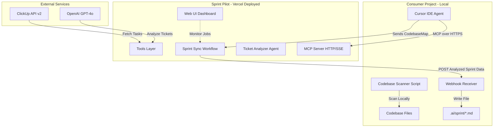

# Sprint Pilot Implementation Plan

Build a **remote** Mastra-based MCP server deployed to Vercel that fetches ClickUp tickets, analyzes them with GPT-4o, and integrates with Cursor IDE via remote MCP connection. Consumer projects scan their codebase locally and send structure to the remote service, which delivers analyzed sprint data back via webhook.

## Architecture Overview



## Data Flow & Integration

### Complete Workflow

1. **Consumer project preparation:**
   - Developer copies client scripts (`scan-codebase.ts`, `webhook-receiver.ts`)
   - Starts local webhook receiver: `bun run webhook-receiver.ts --port 3001`
   - Exposes webhook via ngrok: `ngrok http 3001` → gets public URL

2. **Codebase scanning (client-side):**
   - Runs scanner: `bun run scan-codebase.ts`
   - Scanner outputs `CodebaseMap` JSON with routes, components, actions

3. **Sprint sync trigger (via Cursor):**
   - Developer asks Cursor agent: "Sync sprint tickets"
   - Cursor connects to remote MCP server via `.cursor/mcp.json`
   - Agent calls `run_sprintSync` workflow with:
     - `codebaseMap`: From step 2
     - `webhookUrl`: ngrok URL from step 1
     - `listId`: Optional, defaults to server env

4. **Remote processing (on Vercel):**
   - Workflow fetches ClickUp tasks
   - Analyzes each ticket with GPT-4o + codebase context
   - Generates prioritized sprint markdown
   - POSTs results to webhook URL

5. **Local delivery (webhook receiver):**
   - Receives POST from Vercel
   - Validates request signature (HMAC)
   - Writes sprint markdown to `.ai/sprint/YYYY-MM-DD-sprint.md`
   - Returns success confirmation

6. **Developer usage:**
   - Opens generated sprint file in Cursor
   - Picks tickets to implement
   - Uses Cursor agent with sprint context for implementation

### Why This Architecture?

- **Remote MCP:** Single deployment serves all projects, no per-project installation
- **Client-side scanning:** No need to send entire codebase remotely, preserves privacy
- **Webhook delivery:** Async processing, handles long-running LLM operations
- **Vercel serverless:** Auto-scaling, zero maintenance, pay-per-use

## Phase 1: Project Foundation

### 1.1 Initialize Project Structure

Create base configuration files for Vercel deployment:

- Initialize Bun project with [`package.json`](package.json)
- Configure TypeScript strict mode in [`tsconfig.json`](tsconfig.json)
- Set up Vercel configuration in [`vercel.json`](vercel.json)
- Environment template in [`.env.example`](.env.example)
- Create Git repository with [`.gitignore`](.gitignore)

**Dependencies to install:**

```bash
bun add @mastra/core @mastra/mcp hono zod
bun add -d typescript @types/node tsup
```

**Key configuration:**

- Target: ES2022, Module: ESNext, Strict mode enabled
- Scripts: `dev` (local testing), `build` (Vercel deployment)
- Vercel serverless function for MCP server
- Environment variables: ClickUp tokens, OpenAI key (NO target project path - sent by client)

### 1.2 Vercel Configuration

File: [`vercel.json`](vercel.json)

Configure Vercel deployment for remote MCP server:

```json
{
  "buildCommand": "bun run build",
  "devCommand": "bun run dev",
  "framework": null,
  "outputDirectory": "dist",
  "functions": {
    "api/**/*.ts": {
      "runtime": "nodejs20.x",
      "maxDuration": 60
    }
  },
  "rewrites": [
    { "source": "/mcp", "destination": "/api/mcp" },
    { "source": "/mcp/sse", "destination": "/api/mcp/sse" },
    { "source": "/(.*)", "destination": "/api/index" }
  ]
}
```

**Key points:**

- MCP server endpoint: `/mcp` (HTTP) and `/mcp/sse` (Server-Sent Events)
- Web UI served from `/` via `/api/index`
- 60s max duration for LLM analysis operations

### 1.3 Create Mastra Instance

File: [`src/mastra/index.ts`](src/mastra/index.ts)

Initialize Mastra with OpenAI integration:

- Configure OpenAI model (GPT-4o) with API key from env
- Set up logger for debugging
- Register tools, agents, workflows
- Export singleton Mastra instance

This is the central configuration imported by all modules.

---

## Phase 2: Build Core Tools (Remote)

### 2.1 ClickUp Sync Tool

File: [`src/tools/clickup-sync.ts`](src/tools/clickup-sync.ts)

**Purpose:** Fetch tasks from ClickUp API v2 (runs remotely on Vercel)

**Input Schema (Zod):**

- `listId` (optional string, defaults to `CLICKUP_LIST_ID` env var)
- `includeSubtasks` (boolean, default true)
- `statuses` (optional string array for filtering)

**Implementation:**

- Call `GET https://api.clickup.com/api/v2/list/{list_id}/task`
- Auth via `Authorization` header with ClickUp token from env
- Extract: id, name, description, status, assignees, priority, tags, due_date, custom_fields
- Return typed array of `ClickUpTask` objects

**Error handling:** Validate API token, handle rate limits (429), network errors, timeout after 30s

### 2.2 Ticket Analysis Tool

File: [`src/tools/analyze-ticket.ts`](src/tools/analyze-ticket.ts)

**Purpose:** Use GPT-4o to analyze ticket quality and map to codebase (runs remotely)

**Input Schema:**

- `ticket` (ClickUpTask object)
- `codebaseMap` (CodebaseMap object - **sent by client**, not scanned here)

**Implementation:**

- Construct structured prompt:
                                                                                                                                                                                                                                                                                                                                                                                                                                                                                                                                                                                                                                                                                                                                                                                                                                                                                                                                                                                                                                                                                                                                                                                                                                                                                                                                                                                                                                                                                                                                                                                                                                                                                                                                                                                                                                                                                                                                                                                                                                                                                                                                - **System:** "You are a senior developer reviewing sprint tickets. Assess quality and map to codebase files based on the provided codebase structure."
                                                                                                                                                                                                                                                                                                                                                                                                                                                                                                                                                                                                                                                                                                                                                                                                                                                                                                                                                                                                                                                                                                                                                                                                                                                                                                                                                                                                                                                                                                                                                                                                                                                                                                                                                                                                                                                                                                                                                                                                                                                                                                                                - **User:** Ticket details + full codebase structure (from client)
- Use Mastra's `model.generate` with structured output (Zod schema)
- Return `TicketAnalysis` object

**Output Schema:**

```typescript
{
  qualityScore: 1-5,
  qualityGaps: string[],  // ["missing acceptance criteria", "vague error handling"]
  affectedFiles: string[],  // ["app/(authenticated)/profile/page.tsx"]
  complexityTag: 'fix' | 'feature',
  suggestedApproach: string  // 1-2 sentence implementation strategy
}
```

**Prompt engineering:**

- Emphasize matching ticket keywords to file paths from codebaseMap
- Ask for specific, actionable implementation suggestions
- Request quality gaps with concrete examples

### 2.3 Sprint Formatter Tool

File: [`src/tools/sprint-formatter.ts`](src/tools/sprint-formatter.ts)

**Purpose:** Generate sprint markdown from analyzed tickets (runs remotely, returns string)

**Input Schema:**

- `tickets` (array of ClickUpTask with analysis attached)
- `metadata` (object: sync timestamp, ClickUp list info)

**Implementation:**

- Sort tickets by priority (Urgent > High > Normal > Low), then quality score
- Generate markdown string in standardized format
- Return markdown string (NOT written to file - client handles that)

**Sprint markdown format:**

```markdown
# Sprint: 2026-02-13
Synced from ClickUp List "Sprint 2026-02-13" at 2026-02-13T14:30:00Z

## Tickets (ordered by priority)

### 1. [FEATURE] Add user profile editing
- **ClickUp ID**: abc123
- **Status**: In Progress
- **Quality**: 4/5 (missing: error scenarios)
- **Complexity**: feature
- **Affected files**:
 - `app/(authenticated)/profile/page.tsx`
 - `app/(authenticated)/profile/actions.ts`
- **Suggested approach**: Implement form with React Hook Form, add server actions for profile updates
- **Agent**: /agent

### 2. [FIX] Button styling inconsistency
- **ClickUp ID**: def456
- **Quality**: 5/5
- **Complexity**: fix
- **Affected files**:
 - `components/ui/button.tsx`
- **Suggested approach**: Update variant classes to match design system
- **Agent**: /fix
```

**Note:** This tool only formats - no file I/O since we're running remotely

---

## Phase 3: Build Agent & Workflow (Remote)

### 3.1 Ticket Analyzer Agent

File: [`src/agents/ticket-analyzer.ts`](src/agents/ticket-analyzer.ts)

**Purpose:** Orchestrate remote tools to analyze ClickUp board with client-provided codebase

**Configuration:**

- **Model:** OpenAI GPT-4o (from Mastra config)
- **Tools:** `clickup-sync`, `analyze-ticket`, `sprint-formatter`
- **Instructions:** 

> "You are a sprint planning assistant. When given a codebase structure, you should: 1) Fetch all tasks from ClickUp, 2) Analyze each ticket for quality and map to the provided codebase files, 3) Generate a prioritized sprint markdown. Always provide clear status updates."

**Usage:**

- Conversational via MCP: `ask_ticketAnalyzer("Sync my board", { codebaseMap: {...} })`
- Programmatic from workflow

**Note:** No filesystem access - codebase structure must be provided by caller

### 3.2 Sprint Sync Workflow

File: [`src/workflows/sprint-sync.ts`](src/workflows/sprint-sync.ts)

**Purpose:** Full automated sync pipeline with webhook delivery

**Input Schema:**

- `listId` (optional string, defaults to env)
- `codebaseMap` (required CodebaseMap object - from client scanner)
- `webhookUrl` (required string - where to POST results)
- `webhookSecret` (optional string - for request signing)

**Steps (sequential):**

1. **fetch-tasks:** Call `clickup-sync` with listId
2. **analyze-tickets:** For each task in parallel (max 5 concurrent), call `analyze-ticket` with task + codebaseMap
3. **format-sprint:** Call `sprint-formatter` with analyzed tickets
4. **deliver-webhook:** POST to webhookUrl with:

                                                                                                                                                                                                                                                                                                                                                                                                                                                                                                                                                                                                                                                                                                                                                                                                                                                                                                                                                                                                                                                                                                                                                                                                                                                                                                                                                                                                                                                                                                                                                                                                - Sprint markdown string
                                                                                                                                                                                                                                                                                                                                                                                                                                                                                                                                                                                                                                                                                                                                                                                                                                                                                                                                                                                                                                                                                                                                                                                                                                                                                                                                                                                                                                                                                                                                                                                                - Analyzed tickets array (JSON)
                                                                                                                                                                                                                                                                                                                                                                                                                                                                                                                                                                                                                                                                                                                                                                                                                                                                                                                                                                                                                                                                                                                                                                                                                                                                                                                                                                                                                                                                                                                                                                                                - Metadata (timestamp, ticket count, etc.)
                                                                                                                                                                                                                                                                                                                                                                                                                                                                                                                                                                                                                                                                                                                                                                                                                                                                                                                                                                                                                                                                                                                                                                                                                                                                                                                                                                                                                                                                                                                                                                                                - HMAC signature (if webhookSecret provided)

**Output:** Webhook delivery confirmation

**Priority logic:** Order tickets by:

1. ClickUp priority field (Urgent > High > Normal > Low)
2. Quality score (higher first)
3. Complexity (fixes before features for quick wins)

**Error handling:**

- If webhook delivery fails, retry 3 times with exponential backoff
- Log job results to Vercel logs for debugging
- Return error details to MCP client

---

## Phase 4: Remote MCP Server

### 4.1 Create HTTP MCP Server

File: [`api/mcp.ts`](api/mcp.ts)

**Purpose:** Expose MCP server over HTTP/SSE for remote Cursor connection

**Implementation:**

Vercel serverless function that handles MCP protocol over HTTP:

```typescript
import { MCPServer } from '@mastra/mcp';
import { mastra } from '../src/mastra/index.js';

const server = new MCPServer({
  name: 'sprint-pilot',
  version: '1.0.0',
  transport: 'http', // HTTP/SSE transport for remote access
  tools: {
    clickup_sync: mastra.getTool('clickup-sync'),
    analyze_ticket: mastra.getTool('analyze-ticket'),
    sprint_formatter: mastra.getTool('sprint-formatter'),
  },
  agents: {
    ticketAnalyzer: mastra.getAgent('ticket-analyzer'),
  },
  workflows: {
    sprintSync: mastra.getWorkflow('sprint-sync'),
  },
});

// Vercel serverless handler
export default async function handler(req, res) {
  return server.handleRequest(req, res);
}
```

**SSE Endpoint:**

File: [`api/mcp/sse.ts`](api/mcp/sse.ts)

Handles Server-Sent Events for streaming MCP responses:

```typescript
export default async function handler(req, res) {
  res.setHeader('Content-Type', 'text/event-stream');
  res.setHeader('Cache-Control', 'no-cache');
  res.setHeader('Connection', 'keep-alive');
  
  return server.handleSSE(req, res);
}
```

**Consumer project setup (`.cursor/mcp.json`):**

```json
{
  "mcpServers": {
    "sprint-pilot": {
      "url": "https://sprint-pilot.vercel.app/mcp",
      "transport": "http"
    }
  }
}
```

**Key differences from local MCP:**

- No `command` or `args` - connects via HTTPS
- No local environment variables needed in `.cursor/mcp.json`
- Server environment variables set in Vercel dashboard
- Consumer project must send codebaseMap as tool parameter

---

## Phase 5: Web UI Dashboard

### 5.1 Dashboard Server

File: [`api/index.ts`](api/index.ts)

**Purpose:** Serve monitoring dashboard and job status API

**Routes:**

- `GET /` → Serve [`public/index.html`](public/index.html) dashboard
- `GET /api/jobs` → Return recent sync job history (stored in Vercel KV or memory)
- `GET /api/jobs/:id` → Get specific job details
- `POST /api/test-webhook` → Test webhook delivery (for setup validation)

**Server config:**

- Vercel serverless function (no port needed)
- CORS: Enabled for webhook callbacks
- Deployed with MCP server

### 5.2 Dashboard UI

File: [`public/index.html`](public/index.html)

**Purpose:** Monitor sprint sync jobs and view statistics

**Features:**

- Display recent sync jobs: timestamp, list name, ticket count, status (success/failed)
- Show job details: analyzed tickets, quality scores, webhook delivery status
- Test webhook endpoint form (enter URL, send test POST)
- API health status indicator
- Usage statistics: total syncs, average tickets per sprint, common quality gaps

**Design:**

- Tailwind CDN (no build step)
- Responsive single-page app
- Auto-refresh every 30s
- Color-coded status badges

**Tech stack:** Vanilla HTML/CSS/JS (lightweight, no framework needed)

---

## Phase 6: Client-Side Utilities

Consumer projects need two scripts to integrate with remote Sprint Pilot:

### 6.1 Codebase Scanner

File: [`client/scan-codebase.ts`](client/scan-codebase.ts)

**Purpose:** Scan Next.js App Router project locally and generate CodebaseMap

**Usage:**

```bash
bun run client/scan-codebase.ts
```

**Implementation:**

- Recursively scan `./app/` directory from consumer project root
- Identify Next.js patterns:
                                - Route folders: `(route-group)`, `[dynamic]`, `(authenticated)`
                                - Page files: `page.tsx`, `layout.tsx`, `loading.tsx`, `error.tsx`
                                - Server actions: `actions.ts`
                                - Client components: `client.tsx`, `*.client.tsx`
                                - Component directories: `components/`, `ui/`
- Extract route structure from folder hierarchy
- Optionally parse file exports using TypeScript AST
- Output JSON CodebaseMap to stdout or file

**Output format:**

```json
{
  "routes": [
    { "path": "/profile", "files": ["page.tsx", "actions.ts"] },
    { "path": "/profile/settings", "files": ["page.tsx"] }
  ],
  "components": ["components/ui/button.tsx"],
  "actions": ["app/(authenticated)/profile/actions.ts"]
}
```

**Distribution:** Provide as npm package or copy-paste script

### 6.2 Webhook Receiver

File: [`client/webhook-receiver.ts`](client/webhook-receiver.ts)

**Purpose:** Local HTTP server that receives sprint data from remote Sprint Pilot

**Usage:**

```bash
bun run client/webhook-receiver.ts --port 3001
```

**Implementation:**

- Start local HTTP server (default port 3001)
- Expose `POST /sprint-webhook` endpoint
- Validate incoming requests:
                                - Verify HMAC signature if secret configured
                                - Check content-type is application/json
- Parse sprint data from request body
- Write sprint markdown to `.ai/sprint/YYYY-MM-DD-sprint.md`
- Create `.ai/sprint/` directory if doesn't exist
- Respond with 200 OK + written file path

**Request body format:**

```json
{
  "sprintMarkdown": "# Sprint: 2026-02-13\n...",
  "tickets": [...],
  "metadata": {
    "syncTimestamp": "2026-02-13T14:30:00Z",
    "ticketCount": 12,
    "listId": "abc123"
  },
  "signature": "hmac-sha256-..."
}
```

**Distribution:** Provide as npm package or copy-paste script

**ngrok integration:** Instructions to expose local webhook via ngrok for testing

---

## Phase 7: Documentation & Deployment

### 7.1 Type Definitions

Create shared type definitions in [`src/types/index.ts`](src/types/index.ts):

- `ClickUpTask`
- `CodebaseMap`
- `TicketAnalysis`
- `SprintData`
- `WebhookPayload`

Ensures type safety across all modules.

### 7.2 README

File: [`README.md`](README.md)

**Contents:**

- Project overview: Remote MCP server for AI-powered sprint planning
- Architecture diagram (Vercel deployment, client-side scanning, webhook delivery)
- **Deployment to Vercel:**
        - Connect GitHub repo to Vercel
        - Configure environment variables (ClickUp token, OpenAI key)
        - Deploy and get production URL
- **Consumer project integration:**
        - Copy `client/scan-codebase.ts` and `client/webhook-receiver.ts` to project
        - Configure `.cursor/mcp.json` with remote URL
        - Start local webhook receiver
        - Scan codebase and trigger sync from Cursor
- Usage examples (remote MCP, webhook testing, dashboard monitoring)
- Troubleshooting: webhook connectivity, MCP authentication, timeouts

### 7.3 Client Integration Guide

File: [`CLIENT_SETUP.md`](CLIENT_SETUP.md)

**Step-by-step guide for consumer projects:**

1. **Install client scripts:**
   ```bash
   mkdir -p .sprint-pilot
   # Copy scan-codebase.ts and webhook-receiver.ts
   ```

2. **Configure MCP in `.cursor/mcp.json`:**
   ```json
   {
     "mcpServers": {
       "sprint-pilot": {
         "url": "https://sprint-pilot.vercel.app/mcp",
         "transport": "http"
       }
     }
   }
   ```

3. **Start webhook receiver:**
   ```bash
   bun run .sprint-pilot/webhook-receiver.ts --port 3001
   ```

4. **Expose webhook via ngrok (for remote delivery):**
   ```bash
   ngrok http 3001
   # Use ngrok URL as webhookUrl parameter
   ```

5. **Scan codebase:**
   ```bash
   bun run .sprint-pilot/scan-codebase.ts > codebase-map.json
   ```

6. **Trigger sync from Cursor:**

            - Open Cursor in your project
            - Ask agent: "Run sprint sync with my codebase"
            - Agent calls remote MCP server with codebase map + webhook URL
            - Receive sprint file in `.ai/sprint/`

### 7.4 Verification Steps

After deployment, verify:

1. **TypeScript compilation:** `bun tsc --noEmit` (no errors)
2. **Local dev server:** `bun run dev` (starts local Vercel dev environment)
3. **Deploy to Vercel:** `vercel deploy` (successful build + deployment)
4. **MCP endpoint health:** `curl https://sprint-pilot.vercel.app/mcp` (returns MCP protocol info)
5. **Dashboard loads:** Navigate to `https://sprint-pilot.vercel.app/` (shows dashboard)
6. **Client scanner works:** Run `scan-codebase.ts` in test project (outputs valid JSON)
7. **Webhook receiver works:** Start receiver, send test POST (writes file)
8. **End-to-end test:**

            - Configure test project with `.cursor/mcp.json`
            - Start webhook receiver with ngrok
            - Ask Cursor agent to run sprint sync
            - Verify sprint markdown appears in `.ai/sprint/`

---

## Environment Variables Reference

**Server (Vercel) Environment Variables:**

| Variable | Required | Default | Description |
|---|---|---|---|
| `CLICKUP_API_TOKEN` | Yes | - | Personal API token from ClickUp settings |
| `CLICKUP_TEAM_ID` | Yes | - | Workspace/team ID (for API context) |
| `CLICKUP_SPACE_ID` | No | - | Space ID (optional filtering) |
| `CLICKUP_LIST_ID` | Yes | - | Default list to sync tasks from |
| `OPENAI_API_KEY` | Yes | - | OpenAI API key for GPT-4o |

**Client (Consumer Project) Environment Variables:**

None required for `.cursor/mcp.json`. Consumer projects only need:
- Remote MCP server URL (hardcoded in mcp.json)
- Local webhook receiver port (configurable in script)

---

## Success Criteria

1. **Remote MCP deployment:** Successfully deployed to Vercel with HTTPS endpoint
2. **MCP protocol:** Server exposes 3 tools, 1 agent, 1 workflow via HTTP/SSE
3. **Client scanner:** Successfully scans Next.js App Router project and outputs valid CodebaseMap JSON
4. **Webhook delivery:** Remote workflow POSTs analyzed sprint data to local webhook receiver
5. **File writing:** Webhook receiver creates `.ai/sprint/YYYY-MM-DD-sprint.md` with correct format
6. **Cursor integration:** Consumer project connects to remote MCP server and triggers sprint sync
7. **Ticket analysis accuracy:** >80% of tickets correctly mapped to codebase files (manual review)
8. **Performance:** Full sync completes in <60s for typical board (10-20 tickets)
9. **Dashboard monitoring:** Web UI displays recent job history and statistics
10. **Type safety:** Zero TypeScript compilation errors in strict mode